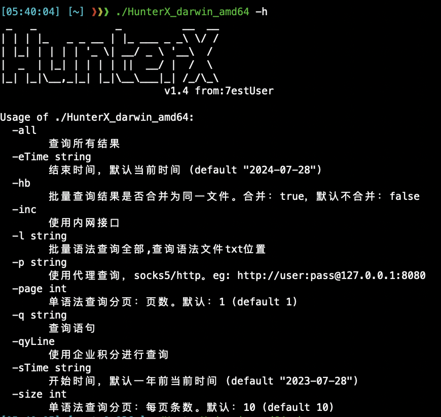
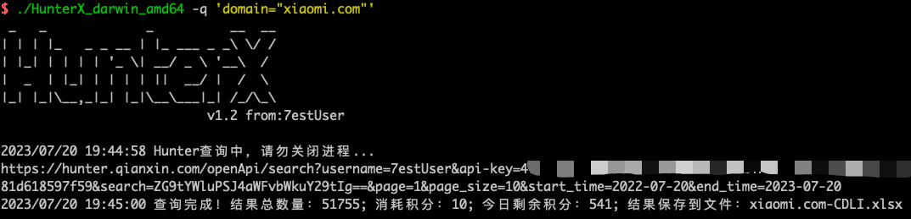

  

- 思想的萌芽🌱：  
编写这个工具最初的目的是因为   
1. 使用企业账号收集资产，权益积分很多，但是导出额度没有，导致我在有很多查询积分的情况下，没办法调用Hunter给的全部查询并导出结果为文件的api接口.所以就只能分页遍历查询并导出为excel文件，反正写都写了，就索性把该有的查询一起写了，当作以后工作中的工具来用。  
2. 公司内部账号虽然可以消除积分焦虑，但是导出额度还是做了限制，为决绝这个问题，通过接口来遍历查询实现全部数据导出。
- 不断的进步💪：  
如果真的有其他人也会用我的工具，就真的太开心了，师傅们如果发现Bug或者感觉哪里需要改进，告诉我，我会更加的努力。
- 暂时的不足💻：  
1. 因为工作时间原因，目前生成运行文件体积较大，回头抽时间优化一下。
2. 最初用多线程跑查询，发现hunter的接口调用有频率限制，甚至单线程跑的快了都不行，所以循环遍历调用接口的时候，做了2秒到等待，导致速度可能比较慢，后面再详细查一下具体原因是因为hunter的接口调用做了频率限制还是其他原因。
## 使用方法
需要在和运行软件的同一目录位置创建配置文件：hunterx.yaml
文件内容：(yaml文件格式，记得冒号后面打一个空格哦，userName好像并没有用。。。)
```yaml
#hunter_userName
userName: 
#hunter_apiKey
apiKey: 
```  
⚠️注意：windows 命令行下需要特别注意双引号转义 eg：fofax.exe -q domain=\\\"a.com\\\"  
⚠️注意：hunter原因，只允许查看前1W条数据，所以 -all查询时如果总数据超过1W，则只查询前1W条数据  
- 参数:  

- 查询:  
默认分页查询（前10条），默认查询时间范围为当前时间1年内，使用个人积分，默认公网接口  
`HunterX -q 'domain="xiaomi.com"'`  
  
文件输出名称为查询语句+四位随机数字符，如果存在不同环境"解析问题，文件命名会使用4位随机字符+4位随机字符，存放当前目录。
- 查询所有并使用内网环境:  
`HunterX -q domain=\"a.com\" -inc -all`  
  
把每次分页的接口调用打印了出来，防止出现问题中断时可以定位查询跑到了哪里。然后可以根据分页来查询后面的。  
- 批量查询:  
`HunterX -l target.txt`  
